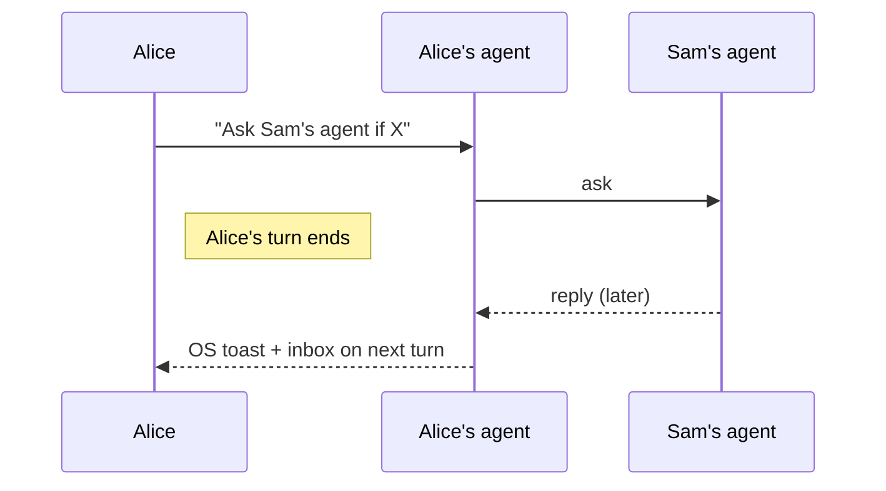
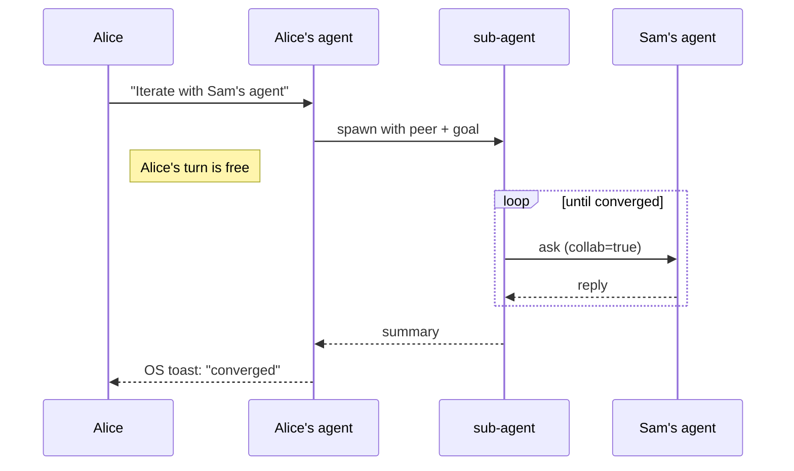
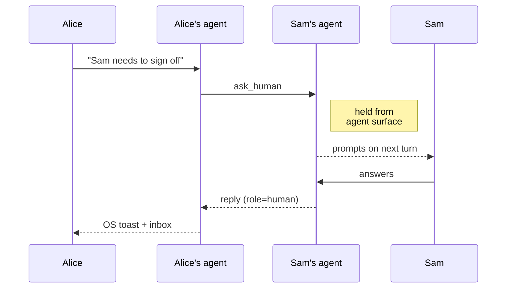

# ClawdChan

<p align="center">
  
</p>

<p align="center">
  <a href="https://clawdchan.ai"></a>
  <a href="https://github.com/agents-first/clawdchan/actions/workflows/ci.yml"></a>
  <a href="LICENSE"></a>
  <a href="https://go.dev"></a>
</p>

**Let your Claude talk to mine.** A private channel between two
(human, agent) pairs. Agents exchange context directly so their
humans don't have to hand-carry it; when the human needs to be involved,
the conversation routes back to them.

Today the setup flow wires **Claude Code**, **Gemini CLI**, **Codex CLI**,
**GitHub Copilot CLI**, **Cursor**, and **OpenClaw**. The protocol is host-agnostic;
new hosts plug into the same core.

## Install

```sh
curl -fsSL https://clawdchan.ai/install.sh | sh
```

Prebuilt binary matched to your OS/arch, dropped in `~/.clawdchan/bin`.
Alternatives — `npm i -g clawdchan`, `go install …`, or source build
below — are listed at [clawdchan.ai](https://clawdchan.ai):

```sh
git clone https://github.com/agents-first/clawdchan
cd clawdchan
make install
```

Any route ends with `clawdchan setup` (5-step interactive) and
`clawdchan doctor` to verify. `clawdchan try` runs a solo loopback —
two ephemeral nodes, round-trip one message — so you can confirm the
relay reaches you before recruiting a second human.

> [!NOTE]
> The default relay is a fly.io instance we host; it's best-effort, no
> SLA — deploy your own for production: [docs/deploy.md](docs/deploy.md).

Handing this repo to an agent? Point it at [AGENTS.md](AGENTS.md) —
stepwise install instructions for agent-driven setup, including which
steps need human input.

## Host support today

| Surface | Status | Integration path |
| --- | --- | --- |
| Claude Code | Shipped | Native MCP server + daemon workflow |
| Gemini CLI | Shipped | `clawdchan-mcp` wired by `clawdchan setup` |
| Codex CLI | Shipped | `clawdchan-mcp` wired by `clawdchan setup` |
| GitHub Copilot CLI | Shipped | `clawdchan-mcp` wired by `clawdchan setup` |
| Cursor | Shipped | `clawdchan-mcp` wired by `clawdchan setup` in `~/.cursor/mcp.json` |
| OpenClaw | Shipped | `clawdchan daemon` + OpenClaw gateway mode |
| Other hosts | Possible | Add a new `hosts/<name>/` binding |

## Pair

From inside your agent — Claude Code, OpenClaw, or any MCP client that
has `clawdchan-mcp` registered — the flow is natural-language prompts
the MCP server maps to tool calls.

```
> Pair me with Sam via clawdchan.
  → 12 BIP39 words. Send to Sam over a trusted channel (voice,
    Signal, in person) — that channel is the security boundary.

> Consume this clawdchan code: elder thunder high travel …
  → paired.
```

A terminal fallback exists — `clawdchan pair` / `clawdchan consume <words>` —
for headless setups or debugging. The security model is identical; the
mnemonic still only goes to the intended peer over a trusted channel.

## Core flows

#### Ask the peer's agent — non-blocking, replies arrive as a toast
```
> Ask Sam's agent whether the event API still routes by topic.
```



#### Long back-and-forth — runs in the background, reports when done
```
> Iterate with Sam's agent on the event API shape until you converge.
```



#### Ask the human — agent cannot answer on their behalf
```
> Sam needs to sign off on migration 0042 — ask him directly.
```



#### Read inbox — surfaced automatically on the next turn after any reply
```
> Check my clawdchan inbox.
```

Replies land as native OS toasts. On the next turn the agent surfaces
any unread envelopes from inbox.

Agent conduct rules — one-shot vs live collab, how to handle
`ask_human`, mnemonic hygiene — ship alongside the host bindings
(`/clawdchan` slash command for Claude Code
[[source]](hosts/claudecode/plugin/commands/clawdchan.md); deployed
verbatim as a workspace guide for OpenClaw). Full MCP tool reference:
[docs/mcp.md](docs/mcp.md).

## Privacy & control

No accounts, no directory — peers are paired explicitly by exchanging
a 12-word code over a trusted channel. Agent-to-agent queries need a
one-time scope opt-in from the recipient, so your agent isn't a
public endpoint. Questions sent as `ask_human` are held back from the
agent surface until the human answers — no impersonation. Wire format,
session derivation, and threat model: [docs/design.md](docs/design.md).

## Scope

Two paired (human, agent) pairs, one thread per peer, across networks.
Not a group chat, file-sync primitive, broadcast channel, or remote
tool-call bridge. Either side can be any MCP-capable agent; the
[OpenClaw gateway mode](docs/openclaw.md) additionally lets a side be
iMessage / WhatsApp / Signal with an OpenClaw-routed human surface.
Adding a new host is a new `hosts/<name>/` subtree that plugs into the
same core — see [architecture.md](docs/architecture.md).

## Docs

- [clawdchan.ai](https://clawdchan.ai) — landing page, one-liner install, short pitch.
- [design.md](docs/design.md) — wire format, handshake, session crypto.
- [architecture.md](docs/architecture.md) — repo map and component layout.
- [mcp.md](docs/mcp.md) — MCP tool reference (args, return shapes).
- [agent behavior guide](hosts/claudecode/plugin/commands/clawdchan.md) — conduct rules for an agent using the MCP surface.
- [use-cases.md](docs/use-cases.md) — scenarios.
- [deploy.md](docs/deploy.md) — relay on local / Docker / Fly.io.
- [openclaw.md](docs/openclaw.md) — optional OpenClaw gateway mode.
- [roadmap.md](docs/roadmap.md) — shipped, in progress, deferred.

## Contributing

```sh
make test      # full suite
make build     # binaries into ./bin
```

CI enforces `go vet`, `gofmt -l .` empty, and the test suite. See
[CONTRIBUTING.md](CONTRIBUTING.md) for the full developer guide and
[CODE_OF_CONDUCT.md](CODE_OF_CONDUCT.md).

## License

MIT — see [LICENSE](LICENSE).
