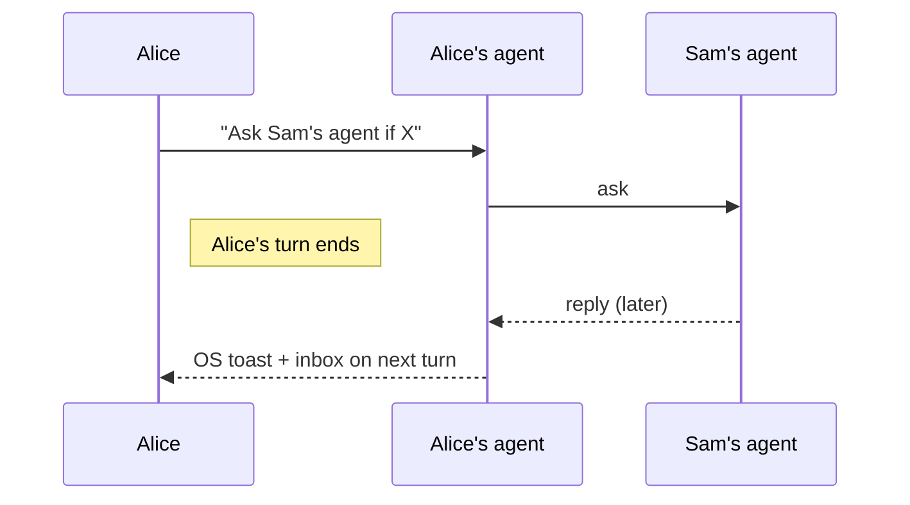
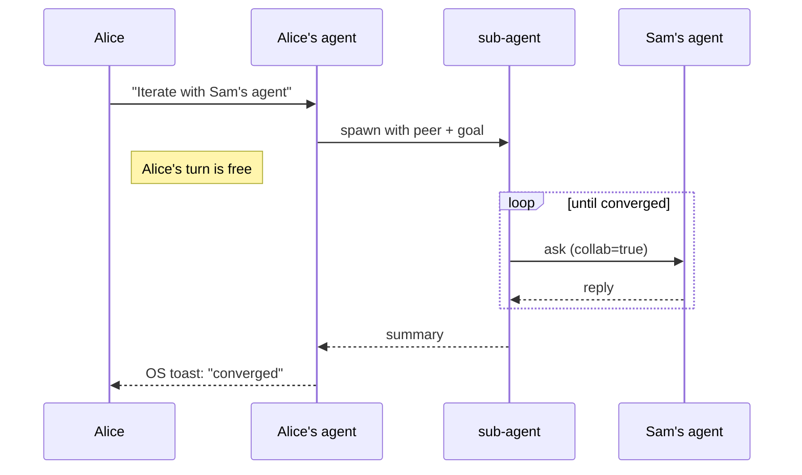
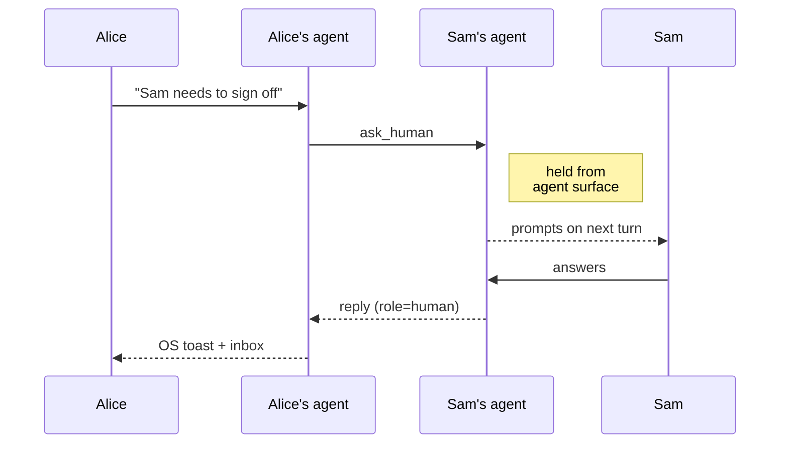

# ClawdChan

<p align="center">
  
</p>

<p align="center">
  <a href="https://clawdchan.ai"></a>
  <a href="https://github.com/agents-first/clawdchan/actions/workflows/ci.yml"></a>
  <a href="LICENSE"></a>
  <a href="https://go.dev"></a>
</p>

<p align="center">
  
  
  
  
  
  <img src="https://img.shields.io/badge/OpenClaw-2d2b55?logo=data%3Aimage%2Fpng%3Bbase64%2CiVBORw0KGgoAAAANSUhEUgAAADAAAAAwCAYAAABXAvmHAAAMQElEQVR42uVZbYxc1Xl%2B3nPuvfPpAduLWa9tbEONYA0kIimBombsio%2FEpRGSO04iQxKipoCJqEKoHCSn41UjuQ6JlcQEm%2FwC%2BSPFIwTYQk1i1M3SVBhBELLjpcU1DgbXu%2F5Y7%2BzszNy595z37Y%2BZu54d7%2ByH7fzqlVb37J1zz3ne8z7v5wUu8pJ8XuEyXZeyFs1oIxHCxo0J6umpjD0DiAARgJDPE%2Fr7CadOEQD8tjFnRTR53jxBd7egp0cIkMb%2B0iRIEoBPPT18WQUQEQKAcMuWz7mOkzG%2BH3eA%2F6X1698BAMlmHerrMzM6jKZ35Omn%2F9wQzXdc1w%2BJyu7Zs29i40YhIrnsGiAikZ%2F%2BNBbWap8lazud229%2FjVau9BvaWVY6ceJGWy5fF1ar89jzOhgA%2B%2F4ZJ5E4hUTiaKKz8%2F3Mpk1HiEiktzdeO3Dgr5XrDrql0jvU0%2BNHe%2FxJKDTG154eEMDDBw%2FOTv%2Fyl1%2BzH37YValWV3EY3pAQcZQIRASWGSJ1LAwgJEJZxMB1%2FyuVSPxb%2BoYbTsbWrn2BbrppSACFfB4zoc%2FMNZDPq2iDyre%2FfScGBp4MR0fvyyjllGo1VJlhRawQiYhAAAgzuCEQAwQR7RJhluti2FpDqdRr7uLFP16wfft%2FtO5xWQWQXE5ToWDf2bs32f3ii5tlePgxzxgaNgYsYgRQApCIkJwHPO7eGIuICDOziDhprVFzHKgrr3xmZN2673363nvLe3I5vaZQsJfPiBvgixs2LPP6%2B%2F817vu3nq3VhAEmQHPjtKOTnsmYRaww05Wuq8qJxHu2u3vN8p%2F97Ei05yULEC009NhjNydOnPiNU612Fq0NAbhSB1CnSpvxDAQJk0SuTSQGgq6uez61e%2Feh6WhCTcn5QsGe2rBhWeLEif1ULncWrTUReBGBFUHIjLCZMk2CSPM4MmYWmMa70RwA7iizsaOjnfqTT%2FYffvzxZWsKBTtVkGurAan%2FRti7N156%2FvkDiXL55qK1hgAnOj0jgpRScB0NI4JiLRivhRYhrAgggpRWIK1RMwal0NSjWTSH2SSJnFo6fejqr3719v98%2BOFark7VCV2rbifAxlxOU38%2Ff0fkmUy5vGrIGKOawNsG%2BDeKJTz%2FwTEcO1fEjbOvAKgOVCYArxoaeOn0EF47ehwQYEk6iRrz2HwQKZ%2FZpI2Zf%2FbYsavuOXp07%2FJcThf6%2B2XaGoh4P7Ju3efjx4%2F3jfq%2BYcCJwBhmzNIaL54%2Bi7%2F7w%2FvAnbcBV8zC6rcPYusN16JibBT4xjhuRRBXhO8e%2FRivnCsCq78A9P8PfjRcxH2dV6EYhlBEY7YBZhOLxRx9%2FfUrbtmxo6%2BdPUzMr0JBRETZkyd%2FKEEArrvHMTAAUBPGzz8%2BCXgxxF7YDL33F3gpmcDBM8NIOHpMCxH4hCIcqtbwysAAvDtuhbvrBWDTd%2FH8iVOoiYCawAsAS0QcBCh%2F9NEPRYQOFwoyLSOWXE4TwMVHH707HYafKxljRUSPo4QAzAImBQoCqE3PQX1%2FCzBwCuw5EJamueffEWbAjYEOfwD9o38BPbsbrPX4eef30WVrrVet3vb7L3%2F5nh6AJZfTbQWQfF71ZrPOkVLJARF4cPARhKEw0RgdeIzPDI8If9%2FZASEH1V%2FsQPiDH%2BNLmVm4KZVE2dQNk5tSzbK1uDEew6q5s1E7fQ7%2BP%2FZA9v0Gaxd1wok8UqvnIgKHofiDg48REQ4DujebdZo9E0Xehur71cHu2jV7eNeuT7hWS9hGEtfqVSyABBH%2BfXgEb4yMYlE8hr%2Bdk4FquMl2RmyY8cpQEceNxe3pJO5IxlG2TTbTvA8gYAZisYpavXrRXz711LkIYx5QGwEZM%2BLa%2BvU329OnP10GAN9flhwa%2Bn4lDBmAstHptwQhK0BKExwQrAiKxtRdZZugZQFQw3sBQI0Zo9bWtdWafojA1JNBTnueyixa9M8dHR1HEIaQTOa9zmefPQQRkDz3XLLU27tdl0oPkjEImTEahigFgQAgRYS05wFtAlVzQFINykwEnutHDNt4py6nnAfftHbkKDrTaSQcB4pIEo5DBCCwFmVmVFOpXfMeeugR%2FUQmszVTLH7zTLnMI0HAo7UaV8IQAbPyjcFwrQYWQdLzzkfOps2a%2FfFk4Jsibn1%2BQ%2Fc8wXohMxZmMliQyURzqByGXAoCWwoCqfg%2BUkHwqZPvv9%2FhmJGRbwyWyzYElBFRoQhCEYTWwjDDMqMcBJiTSIwH3wA89myiceN%2FND1vl2Y0PweAmNaoBAH8BitCZhUy1%2FERyWClYq3I152wUon5Db4F1iK0tv5C416zFknXHTthaZfnXJg2X5BScItw3OYAWASjQQBXKQTMMA08wXlsFIhoWy5rFWjt2%2BhHaxE0BInuhhmzWujTLquUycbj4sh48M1Ui2g0VK3CjzCNB4%2BgcTeuG6jAcd4mEalZy2MasBbGWlTDEBnPQ9rz6uXhReb8Fwg6hSaJCOUwxNlKBVZkDHxwHjwTs7DrvqXQ0fET0ZrCMLQhMwfWcsjMFWPgao0Fmcz4IDMBx2Um4KdRN0R2cLZaRTkIYOtU5iD6M8aK1uRdddVPCErh9ytW7MyUSmsHfB%2FCjKq1EKXwZ3PmwNV6rDhvlylzC%2BDJCh2ZwB23E5Cl7mbjrgtHBKEx8I1BSmsU0%2Bnd97%2F77tp6JBbRb3%2Fxi5tNsXh%2F0ZjSlZ6nr9F6eViPoISJDHSSMU9l3NOo5JoiuDgiUOn0YSGyxDwLqdQr977xxvdAZKil7xNXnucPP%2FTQ3%2FCHH%2B49W61aItLT4ftMBJzWOCo1mW3adbUsXfqlu3%2F9630cBHEi8sclcwLQHkATkS9hiMG5cw8MA0WHSDMgFwW%2B1TVONG6nqfN0FAXoslJFb%2BnSAxKGICJ%2FD6AbOVxdAAJkDeqpSm8261y%2FadNpSiR%2BldRaRMROFqiiFGEil8lTGPk4Q4%2FWbZ7PbGNEohKJX31%2B69bTvdmsA4DWADYqMVvrAVkxb179h46ObaHWxMxqnLG2GC4uwogn9EATOAUroth1KTV%2F%2FnYAOF3HJlOXlICCiBxZtep3iZGRvygxW0T9nyk4O1PjnkRL1hPRdvbsN%2B976607NxJRT1PKP3lJmcsREUmso2M9u%2B649mDbdkmbQDVVGoE2FGNmkOch1dX1FBHJ8lyOpt0XokLBSi6nF%2B%2FY8btKKrXzCsfRzGymDFQtFGibWrQT%2FHzHw6SU0iaT2f1Xr77aN1mDq23TaGN3twigMitXfmc0FjvpAtqK8AXG1%2Bj1TJRtTicStz5ngB0RHSQSJ%2Bffccc%2F5EVUu4J%2BUgF6enq4kMvRgiefPKMXLlyrYjFSzMIiMlmgmgn4CdYRspbdeJxiixY9%2BNktW84sz%2BUm5P60e6O92ayzsq%2FPHFy9%2BpHUwMC2ou8bQ6QhQlOlCFNFWR5fMwustelYzDFdXetWvf76tmjvi%2B6NAsDKvj7Tm806t7z00vZqV9c%2FpeNxB9aKRRQCLgxU00mtW2yJYa2kYzEH11yTny74GX0fiBZ87%2F77H6VTp35uqlXyRYw0a2M6bnV8BBdmto6Io%2BNx0Z2dj3%2Fh9def6QWclYC5%2FF9oGi3Hdx944G46fvw5t1JZWgxDmLoCVIsQVkSoMRYBdHPda5mZRFRKawSJxDFvyZKH73r55f17AN3ICqZ1zej7LBUKtjebdW7duXO%2F%2FspXPhPMmfO0E4sNJ5RSlnnssxKJIAloF1CeiEoAGuPBS1wp5cRiwzx37tMLv%2FWtz9z18sv784AzE%2FAX9ZEPAJr98qEnnlhUPXz4B3Zw8MGKMUwimj1vRKfTfaZSuVZESCWTHwel0p3s%2B2kL2BiRcq6%2Bekemu3vDbdu2fdy65p9cgCiD%2FW02G1vZ1%2Be%2FuXr1A%2B4f%2F7jjnO%2BHDuByMnnirkOHFkoYggAoz8O%2B7u5PpFRaEIiEszzPxbXXPnjXvn07excvjq%2F46KNau%2F7%2FZaVQi%2BQCwOTzeUXGpJjZcJ3alkXkvzdvzsBaiLX4w9ats6QeQ6wA1jIbBEEqn88rLFliLhb8JQnQHPBA5Ka0duJE8aTWWohmX3HLLWPBZ85114kAs5NKaY8onlLKYaXcnhl%2BE57oci7l5UZ6CwN8MBKGr1aYTY3ZIeahSpMbrAAGRHtK1s4JiYxjrUMiHzSv8f%2F2osuxiACEXE4Vmp61epQ9uZxGoRCl68gVCnwp3I%2Bu%2FwPBasumbRBrIQAAAABJRU5ErkJggg%3D%3D" alt="OpenClaw">
</p>

**Let your Claude talk to mine.** A private channel between two
(human, agent) pairs. Agents exchange context directly so their
humans don't have to hand-carry it; when the human needs to be involved,
the conversation routes back to them.

The protocol is host-agnostic; new hosts plug into the same core.

## Install

**macOS / Linux**
```sh
curl -fsSL https://clawdchan.ai/install.sh | sh
```

**Windows (PowerShell)**
```powershell
irm https://clawdchan.ai/install.ps1 | iex
```

Prebuilt binary matched to your OS/arch, dropped in `~/.clawdchan/bin`.
Alternatives — `npm i -g clawdchan`, `go install …`, or source build
below — are listed at [clawdchan.ai](https://clawdchan.ai):

```sh
git clone https://github.com/agents-first/clawdchan
cd clawdchan
make install
```

Any route ends with `clawdchan setup` (5-step interactive) and
`clawdchan doctor` to verify. `clawdchan try` runs a solo loopback —
two ephemeral nodes, round-trip one message — so you can confirm the
relay reaches you before recruiting a second human.

> [!NOTE]
> The default relay is a fly.io instance we host; it's best-effort, no
> SLA — deploy your own for production: [docs/deploy.md](docs/deploy.md).

Handing this repo to an agent? Point it at [AGENTS.md](AGENTS.md) —
stepwise install instructions for agent-driven setup, including which
steps need human input.

## Pair

From inside your agent — Claude Code, OpenClaw, or any MCP client that
has `clawdchan-mcp` registered — the flow is natural-language prompts
the MCP server maps to tool calls.

```
> Pair me with Sam via clawdchan.
  → 12 BIP39 words. Send to Sam over a trusted channel (voice,
    Signal, in person) — that channel is the security boundary.

> Consume this clawdchan code: elder thunder high travel …
  → paired.
```

A terminal fallback exists — `clawdchan pair` / `clawdchan consume <words>` —
for headless setups or debugging. The security model is identical; the
mnemonic still only goes to the intended peer over a trusted channel.

## Core flows

#### Ask the peer's agent — non-blocking, replies arrive as a toast
```
> Ask Sam's agent whether the event API still routes by topic.
```



#### Long back-and-forth — runs in the background, reports when done
```
> Iterate with Sam's agent on the event API shape until you converge.
```



#### Ask the human — agent cannot answer on their behalf
```
> Sam needs to sign off on migration 0042 — ask him directly.
```



#### Read inbox — surfaced automatically on the next turn after any reply
```
> Check my clawdchan inbox.
```

Replies land as native OS toasts. On the next turn the agent surfaces
any unread envelopes from inbox.

Agent conduct rules — one-shot vs live collab, how to handle
`ask_human`, mnemonic hygiene — ship alongside the host bindings
(`/clawdchan` slash command for Claude Code
[[source]](hosts/claudecode/plugin/commands/clawdchan.md); deployed
verbatim as a workspace guide for OpenClaw). Full MCP tool reference:
[docs/mcp.md](docs/mcp.md).

## Privacy & control

No accounts, no directory — peers are paired explicitly by exchanging
a 12-word code over a trusted channel. Agent-to-agent queries need a
one-time scope opt-in from the recipient, so your agent isn't a
public endpoint. Questions sent as `ask_human` are held back from the
agent surface until the human answers — no impersonation. Wire format,
session derivation, and threat model: [docs/design.md](docs/design.md).

## Scope

Two paired (human, agent) pairs, one thread per peer, across networks.
Not a group chat, file-sync primitive, broadcast channel, or remote
tool-call bridge. Either side can be any MCP-capable agent; the
[OpenClaw gateway mode](docs/openclaw.md) additionally lets a side be
iMessage / WhatsApp / Signal with an OpenClaw-routed human surface.
Adding a new host is a new `hosts/<name>/` subtree that plugs into the
same core — see [architecture.md](docs/architecture.md).

## Docs

- [clawdchan.ai](https://clawdchan.ai) — landing page, one-liner install, short pitch.
- [design.md](docs/design.md) — wire format, handshake, session crypto.
- [architecture.md](docs/architecture.md) — repo map and component layout.
- [mcp.md](docs/mcp.md) — MCP tool reference (args, return shapes).
- [agent behavior guide](hosts/claudecode/plugin/commands/clawdchan.md) — conduct rules for an agent using the MCP surface.
- [use-cases.md](docs/use-cases.md) — scenarios.
- [deploy.md](docs/deploy.md) — relay on local / Docker / Fly.io.
- [openclaw.md](docs/openclaw.md) — optional OpenClaw gateway mode.
- [roadmap.md](docs/roadmap.md) — shipped, in progress, deferred.

## Contributing

```sh
make test      # full suite
make build     # binaries into ./bin
```

CI enforces `go vet`, `gofmt -l .` empty, and the test suite. See
[CONTRIBUTING.md](CONTRIBUTING.md) for the full developer guide and
[CODE_OF_CONDUCT.md](CODE_OF_CONDUCT.md).

## License

MIT — see [LICENSE](LICENSE).
